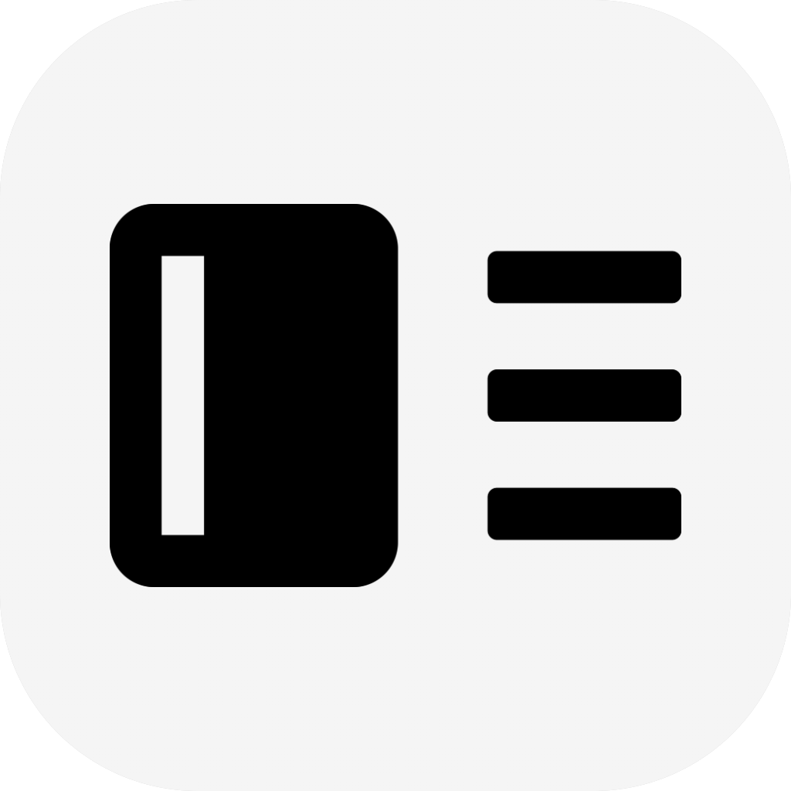

# Deskset-Release

    </img>
    
欢迎使用数字桌搭 Deskset

    
一款桌面美化软件

    
基于 Web 技术开发

    
实现桌面美化与笔记应用间的互动

## 简介

数字桌搭是一款前后端分离的桌面美化软件，旨在整合笔记应用，优化笔记的创建管理流程，从而提升个人效率和生产力。

目前，数字桌搭正处于早期开发阶段，采用 Electron + FastAPI 的组合以快速构建项目。不过，当项目成熟后，将计划加入 Tauri 框架作为前端显示，减少资源占用并提升性能。

前端：
- Electron 版代码：https://github.com/Nostalgia-Season-Train/Deskset-Electron
- Tauri 版代码：https://github.com/Nostalgia-Season-Train/Deskset-Tauri

后端：
- FastAPI：暂时闭源

## 交流
QQ 群：770889923
